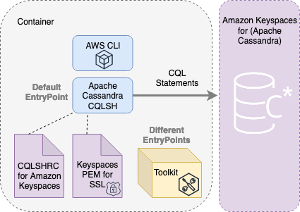

#  Amazon Keyspaces (for Apache Cassandra) developer toolkit

This repository provides a Docker image for common tooling for Amazon Keyspaces. Keyspaces for functional testing, light operations, and data migration.

The toolkit is optimized for Amazon Keyspaces, but will also work with Apache Cassandra clusters.

## Amazon Keyspaces (for Apache Cassandra)
[Amazon Keyspaces](https://aws.amazon.com/keyspaces/) is a scalable, highly available, and managed Apache Cassandra–compatible database service. Amazon Keyspaces is serverless, so you pay for only the resources you use and the service can automatically scale tables up and down in response to application traffic.

## What's included
This container extends from [awscli container](https://aws.amazon.com/blogs/developer/aws-cli-v2-docker-image/) and includes the following Cassandra components:
* 3.11.6 Apache Cassandra distribution of CQLSH
* Amazon Web Services pem file for SSL connectivity
* CQLSHRC file with best practices
* Helpers/examples to perform to common task
* AWS CLI. Official Documentation [See How to use the AWSCLI Container](https://aws.amazon.com/blogs/developer/aws-cli-v2-docker-image/)
* optional cqlsh expansion that integrates sigv4 authentication

### Architecture


* CQLSHRC file is located at root directory of this project
* Toolkit scripts located in /bin directory of this project
* Keyspaces PEM file is downloaded when creating the image
* Apache Cassandra 3.11 branch CQLSH scripts
* Extends from AWS CLI Container Image and can be accessed via overriding the [entrypoint](https://docs.docker.com/engine/reference/builder/#entrypoint) parameter

# TLDR;
The following steps to connect to Amazon Keyspaces using the Toolkit. Clone. Build Image. Connect to Keyspaces and Go!  

```sh
docker build --tag amazon/keyspaces-toolkit --build-arg CLI_VERSION=latest https://github.com/aws-samples/amazon-keyspaces-toolkit.git

docker run --rm -ti amazon/keyspaces-toolkit cassandra.us-east-1.amazonaws.com 9142 -u "SERVICEUSERNAME" -p "SERVICEPASSWORD" --ssl

```

# Using Sigv4 Authentication with cqlsh
The toolkit contains a version of cqlsh that extends Authentication functionality to leverage the [Sigv4 athentication plugin for the Python Cassandra driver](https://github.com/aws/aws-sigv4-auth-cassandra-python-driver-plugin). This plugin enables IAM users, roles, and federated identities to add authentication information to Amazon Keyspaces (for Apache Cassandra) API requests using the AWS Signature Version 4 Process (SigV4). You can leverage this functionality by passing "cqlsh-expansion" to the ```--entrypoint``` docker run parameter, and the ```--sigv4``` flag to the cqlsh-expansion process. You can use the docker container host's credentials by mounting the AWS CLI configuration directory to the container using the mount command ```-v```. If your AWS configuration is stored in ~/.aws then the Docker mount command would be `-v ~/.aws:/root/.aws`.

```sh
docker build --tag amazon/keyspaces-toolkit --build-arg CLI_VERSION=latest https://github.com/aws-samples/amazon-keyspaces-toolkit.git

docker run -ti --rm -v ~/.aws:/root/.aws --entrypoint cqlsh-expansion amazon/keyspaces-toolkit cassandra.us-east-1.amazonaws.com --ssl --sigv4
```

# Prerequisites

### Generate Service Specific Credentials
Service-specific credentials enable IAM users to access a specific AWS service. The credentials cannot be used to access other AWS services. They are associated with a specific IAM user and cannot be used by other IAM users.

* See official documentation for IAM user [Generated service-specific credentials](https://docs.aws.amazon.com/keyspaces/latest/devguide/programmatic.credentials.html) for Amazon Keyspaces


### Setup Docker

Containers add a level of platform independence allowing for installation on various operating systems including Linux, Mac, and Windows. Find your operating system below, and follow the installation process. After installing, you will have access to the docker terminal from the command line terminal.

* Windows: [Visit Windows Download and Tutorial](https://docs.docker.com/docker-for-windows/install/)
* Mac: [Visit Mac Download and Tutorial](https://docs.docker.com/docker-for-mac/install/)
* Linux: [Visit Linux Download and Tutorial](https://docs.docker.com/engine/install/)

# Run
---

The following section will provide examples of CQLSH usage with Apache Cassandra and Amazon Keyspaces.

### Clone this repo
The following command will clone this repository and pull down submodules

```sh
  git clone --recurse-submodules https://github.com/aws-samples/amazon-keyspaces-toolkit   
```

### Use an alias
In this section we will assign the previous command to an alias. In simplifying the setup introduced additional commands for Docker. To reduce the extra
Docker commands we can leverage an alias (or DOSKEY for windows) to replace a
bulk for the command. The alias acts as a shortcut replacing the text of the Docker command with an alias keyword.

*We do not recommend you store the user name and password in the alias. Later in this document we will show you how to leverage AWS Secrets Manager. to avoid using plain text credentials with CQLSH.*

Parameters for alias

```-v "$(pwd)"``` :/source mount the current directory of the host. Useful for importing
and exporting data with COPY or using the CQLSH --file command to load external
CQLSH scripts
```-v "${HOME}/.cassandra/cqlsh_history"``` Maintain cqlsh history across sessions

```sh
#!/bin/bash

alias cqlsh='touch ${HOME}/.cassandra/cqlsh_history && docker run --rm -ti -v "$(pwd)":/source -v "${HOME}/.cassandra/cqlsh_history":/root/.cassandra/cqlsh_history amazon/keyspaces-toolkit'

```

You can now connect to Amazon Keyspaces using CQLSH command and pass in the host port and user name and password.

```sh
cqlsh cassandra.us-east-1.amazonaws.com 9142 --ssl \
-u "SERVICEUSERNAME" -p "SERVICEPASSWORD" --ssl
```

## Executing statements

We can also use this container to execute commands using the --execute parameter. For a list of CQLSH commands see the following resource: [List of CQLSH commands](https://cassandra.apache.org/doc/latest/tools/cqlsh.html). This will allow you to embed this functionality in existing scripts.

  ```sh
  cqlsh cassandra.us-east-1.amazonaws.com 9142 --ssl \
  -u "SERVICEUSERNAME" -p "SERVICEPASSWORD" --ssl \
  --execute "CREATE KEYSPACE \"amazon\" WITH REPLICATION = {'class': 'SingleRegionStrategy'}"
```

## Executing files

We can also use this container to execute commands using the --file parameter. Since we mounted the current directory with the alias statement we can now utilize scripts on the host machine.

  ```sh
  cqlsh cassandra.us-east-1.amazonaws.com 9142 \
  -u "SERVICEUSERNAME" -p "SERVICEPASSWORD" --ssl \
  --file "/source/my_script.cql"
```

## Connecting to Apache Cassandra
To connect to Apache Cassandra override the default CQLSHRC file.

Change the endpoint to the local cassandra clusters

```sh
cqlsh localhost 9042 -u "cassandra" -p "cassandra"
```
or using the mount established previous example to load a different CQLSHRC file with the `--cqlshrc` paramter

```sh
cqlsh --cqlshrc '/source/.local-cassandra/cqlshrc'
```


# Toolkit
In this section we will describe usage for the helpers found in the /bin directory. Each example can be used by changing the `entrypoint` to the container.

## AWS CLI
The keyspaces-toolkit extends the AWS CLI Docker image making the keyspaces-
toolkit extremely light-weight. Since you may already have the AWS CLI Docker
image in your local repository, the keyspaces-toolkit adds only an additional 10mb
layer extension of the AWS CLI.

Changing the entry point to `aws` will allow you to access the AWS CLI. Mounting the `.aws` directory of the host machine will allow you to leverage the credentials stored on the host machine.

```sh
docker run --rm -ti \
-v ~/.aws:/root/.aws \
--entrypoint aws \
amazon/keyspaces-toolkit
configure list-profiles
```

## AWS Secrets Manager Wrapper
When using [Generated service-specific credentials](https://docs.aws.amazon.com/keyspaces/latest/devguide/programmatic.credentials.html) it is common practice to store the username and password in [AWS Secrets Manager](https://aws.amazon.com/secrets-manager/). This allows you to use the AWS CLI to retrieve the credentials and not expose the credentials in plain text. The following script will use the AWS CLI config profile to grab stored service credentials from AWS Secrets Manager.

#### Store Generated User Credentials in Amazon Secrets Manager
AWS Secrets Manager helps you protect secrets needed to access your applications, services, and IT resources. The service enables you to easily rotate, manage, and retrieve database credentials, API keys, and other secrets throughout their lifecycle. Replace `SERVICEUSERNAME` and `SERVICEPASSWORD` with the generated values. The `--name` parameter signifies the key used to access credentials in later examples _**keyspaces-credentials**_

```sh
aws secretsmanager create-secret --name keyspaces-credentials \
--description "Store Amazon Keyspaces Generated Service Credentials" \
--secret-string "{\"username\":\"SERVICEUSERNAME\", \"password\":\"SERVICEPASSWORD\"}"
```

#### Execute Secrets Manager Wrapper Entrypoint
The container provides a script `aws-sm-cqlsh.sh` which will call out to the secrets manager and append the user and password to your CQLSH statement. It requires AWS CLI to be installed and configured on host or setup within container. The `-v` parameter is used in the example below to locate the awscli configuration on the host instance.

`Parameters`

* `--rm` - removes the container after ending the CQLSH session
* `-ti`  - interactive bash shell in the container
* `-v` - mount a volume from existing directory
  * ~/.aws:/root/.aws in the example is the location of the host awscli configuration on _*localhost:container*_
* `--entrypoint` - choses a wrapper script for CQLSH with the username and password extracted from AWS Secrets Manager.

`aws-sm-cqlsh.sh Parameters`
* First parameter will be the AWS Secrets Manager key we created in the Prerequisites step. Every parameter following the secrets key will be passed into CQLSH command

_*Example: open cqlsh shell*_
```sh
docker run --rm -ti \
-v ~/.aws:/root/.aws \
--entrypoint aws-sm-cqlsh.sh \
 amazon/keyspaces-toolkit keyspaces-credentials \
 cassandra.us-east-1.amazonaws.com 9142 --ssl
```
_*Example: execute statement*_
```sh
docker run --rm -ti \
-v ~/.aws:/root/.aws \
--entrypoint aws-sm-cqlsh.sh  \
 amazon/keyspaces-toolkit keyspaces-credentials \
 cassandra.us-east-1.amazonaws.com 9142 --ssl \
 --execute "CREATE TABLE aws.workshop(
	id text,
	time timeuuid,
	event blob,
	PRIMARY KEY(id, time))
  WITH CUSTOM_PROPERTIES = {'capacity_mode':{'throughput_mode':'PAY_PER_REQUEST'}}"

```

## Exponential Backoff Wrapper
Keyspace and table creation are Asynchronous in Amazon Keyspaces. This asynchronous functionality is different than Apache Cassandra where table creation is synchronous. We have been told by customers that some existing scripts require synchronous behavior when creating a table. A common solution is to add an exponential backoff describe statement to notify users when the table is created. This container contains an exponential backoff helper that will attempt multiple times until the CQL statement succeeds. Other options include building a CloudFormation template.

`Parameters`
* $1 maximum time for program to run in seconds
* $2 maximum number of attempts to run
* $3 CQL Statement to run

```sh
#!/bin/bash

#create a table
docker run -ti --name createtablec amazon/keyspaces-toolkit \
cassandra.us-east-1.amazonaws.com 9142 \
-u "SERVICEUSERNAME" -p "SERVICEPASSWORD" --ssl \
--execute "CREATE TABLE aws.workshop_backofftest(
 id text,
 time timeuuid,
 event blob,
 PRIMARY KEY(id, time))
 WITH CUSTOM_PROPERTIES = {'capacity_mode':{'throughput_mode':'PAY_PER_REQUEST'}}"

# Check the error code of container.
# Make sure to drop the --rm statement from the previous run command.
docker inspect createtablec --format='{{.State.ExitCode}}'

#ok to remove
docker rm createtablec

#exponential backoff describe
#run for 30 seconds or 120 attempts which ever comes first
docker run --rm -ti --entrypoint aws-cqlsh-expo-backoff.sh amazon/keyspaces-toolkit \
 30 120 \
 cassandra.us-east-1.amazonaws.com 9142 \
 --ssl -u "SERVICEUSERNAME" -p "SERVICEPASSWORD" \
 --execute "DESCRIBE TABLE aws.workshop_backofftest"
```


# Cheatsheet

```text
--- Docker ---
#Logs
$> docker logs CONTAINERID

#Remove Image
$> docker rmi amazon/keyspaces-toolkit

#exit code
docker inspect createtablec --format='{{.State.ExitCode}}'


--- CQL ---
#Describe keyspace
DESCRIBE KEYSPACE keyspace_name;

#Select Samples
SELECT * FROM keyspace_name.table_name LIMIT 10;

--- Serverless ---
#Change Provisioned Capacity
ALTER TABLE aws.workshop WITH custom_properties={'capacity_mode':{'throughput_mode': 'PROVISIONED', 'read_capacity_units': 4000, 'write_capacity_units': 3000}} ;

#Describe current capacity mode
SELECT keyspace_name, table_name, custom_properties FROM system_schema_mcs.tables where keyspace_name = 'aws_cassandra_ws';

--- Linux ---
#Line count of multiple/all files in the current directory
find . -type f | wc -l

#Remove header from csv
sed -i '1d' myData.csv
```

# Security

See [CONTRIBUTING](CONTRIBUTING.md#security-issue-notifications) for more information.

# License

This library is licensed under the MIT-0 License. See the LICENSE file.
